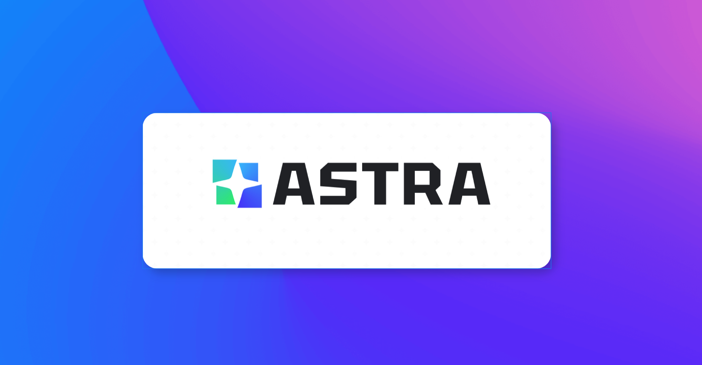
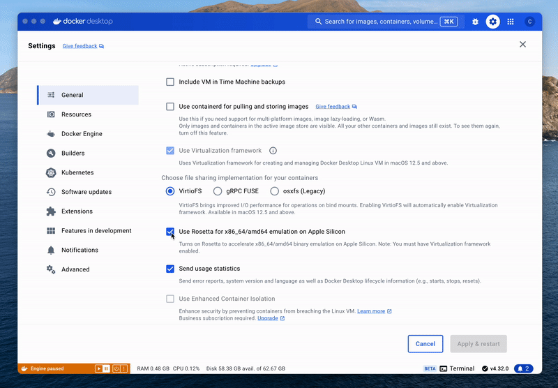

<div align="center">
 
</div>

<br>

<div align="center">

[](https://twitter.com/intent/follow?screen_name=AstraFramework)
[](https://github.com/rte-design/astra.ai/discussions/)
[](https://github.com/rte-design/astra.ai/graphs/commit-activity)
[](https://github.com/rte-design/ASTRA.ai/issues)
[](https://github.com/rte-design/ASTRA.ai/pulls)
[](https://github.com/rte-design/ASTRA.ai/blob/main/LICENSE)

[](https://discord.gg/p85NR8UD)

[](https://GitHub.com/rte-design/astra.ai/watchers/?WT.mc_id=academic-105485-koreyst)
[](https://GitHub.com/rte-design/astra.ai/network/?WT.mc_id=academic-105485-koreyst)
[](https://GitHub.com/rte-design/astra.ai/stargazers/?WT.mc_id=academic-105485-koreyst)

<a href="./README.md"></a>
<a href="./README-CN.md"></a>

<a href="">
<span>Real-time Multi-model Interactions</span>
</a>
<span>&nbsp;&nbsp;•&nbsp;&nbsp;</span>
<a href="">
<span>Low Latency</span>
</a>
<span>&nbsp;&nbsp;•&nbsp;&nbsp;</span>
<a href="">
<span>Supporting Multiple languages</span>
</a>

</div>

<br >

ASTRA is an open-source platform designed for developing applications utilizing large language models. It merges the ideas of Backend-as-a-Service and LLM operations, allowing developers to swiftly create production-ready generative AI applications. Additionally, it empowers non-technical users to engage in defining and managing data operations for AI applications.

With ASTRA, you can easily create real-time, multi-modal AI applications with low latency, even without any coding knowledge. 🎉

<br>
<h2>Voice Agent</h2>

ASTRA is a versatile platform that can be used to build a wide range of applications. Here, we present a fantastic example of [an intuitive Voice Agent ](https://astra-agents.agora.io/) built on ASTRA.

<div align="center">

</div>

As you can see, the real-time multimodal interactions, low latency, and responsive feedback all showcase the power of ASTRA.

<h3>Run Voice Agent Locally</h3>

Of course, you are more than welcome to run the example voice agent locally. We have a Docker image ready for you to build and run the agent on both macOS and Windows.

To start, make sure you have:

- Agora App ID and App Certificate([Read here on how](https://docs.agora.io/en/video-calling/get-started/manage-agora-account?platform=web))
- Azure's [speech-to-text](https://azure.microsoft.com/en-us/products/ai-services/speech-to-text) and [text-to-speech](https://azure.microsoft.com/en-us/products/ai-services/text-to-speech) API keys
- [OpenAI](https://openai.com/index/openai-api/) API key
- [Docker](https://www.docker.com/)

```bash
# run the pre-built agent image
docker run --restart=always -itd -p 8080:8080 \
        -v /tmp:/tmp \
        -e AGORA_APP_ID=<your_agora_appid> \
        -e AGORA_APP_CERTIFICATE=<your_agora_app_certificate> \
        -e AZURE_STT_KEY=<your_azure_stt_key> \
        -e AZURE_STT_REGION=<your_azure_stt_region> \
        -e OPENAI_API_KEY=<your_openai_api_key> \
        -e AZURE_TTS_KEY=<your_azure_tts_key> \
        -e AZURE_TTS_REGION=<your_azure_tts_region> \
        --name astra_agents_server \
        agoraio/astra_agents_server:0.1.2
```

#### Mac with Apple Silicon

You will need to uncheck "Use Rosetta for x86_64/amd64 emulation on apple silicon" option for Docker if you are on Apple Silicon.

<div align="center">



</div>

This should start an agent server running on port 8080.

<h3>Connect to Your Agent</h3>

You can use the playground project to test with the server you just started.

The Playground project is built on NextJS 14, hence it needs Node 18+.

```bash
# set up an .env file
cp ./playground/.env.example ./playground/.env
cd playground

# install npm dependencies & start
npm i && npm run dev
```

🎉 Congratulations! You now have our ASTRA powered voice agent running locally.

<br />
<h2>Agent Customization</h2>

Our voice agent is a great place for you to start with, it uses following Extensions:

- _agora_rtc_ / [Agora](https://docs.agora.io/en) for RTC transport + VAD + Azure speech-to-text (STT)
- _azure_tts_ / [Azure](https://azure.microsoft.com/en-us/products/ai-services/text-to-speech) for text-to-speech (TTS)
- _openai_chatgpt_ / [OpenAI](https://openai.com/index/openai-api/) for LLM
- _chat_transcriber_ / A utility ext to forward chat logs into channel
- _interrupt_detector_ / A utility ext to help interrupt agent

<div align="center">

<image alt="ASTRA" src="./images/image-2.png">

</div>

<h3>Customize Agent</h3>

You might want to add more flavors to make the agent better suited to your needs. To achieve this, you need to change the source code of extensions and build the agent yourselves.

You need to prepare the proper `manifest.json` file first.

```bash
# rename manifest example
cp ./agents/manifest.json.example ./agents/manifest.json
cp ./agents/manifest.json.en.example ./agents/manifest.en.json
cp ./agents/manifest.json.cn.example ./agents/manifest.cn.json

# pull the docker image with dev tools and mount your current folder as workspace
docker run -itd -v $(pwd):/app -w /app -p 8080:8080 --name astra_agents_dev ghcr.io/rte-design/astra_agents_build:0.3.2 

# for windows git bash
# docker run -itd -v //$(pwd):/app -w //app -p 8080:8080 --name astra_agents_dev ghcr.io/rte-design/astra_agents_build:0.3.2

# enter docker image
docker exec -it astra_agents_dev bash

# build agent
make build
```

This code generates an agent executable. To customize your prompts and OpenAI parameters, modify the source code in agents/addon/extension/openai_chatgpt/openai_chatgpt.go.

Once you have made the necessary changes, you can use the following commands to start a server. You can then test it out using the ASTRA voice agent playground as we did in previous steps.

```bash

export AGORA_APP_ID=<your_agora_appid>
export AGORA_APP_CERTIFICATE=<your_agora_app_certificate>
export AZURE_STT_KEY=<your_azure_stt_key>
export AZURE_STT_REGION=<your_azure_stt_region>

# openai
export OPENAI_API_KEY=<your_openai_api_key>
# qwen
export QWEN_API_KEY=<your_qwern_api_key>

# TTS
# cosy
export COSY_TTS_KEY=<your_cosy_tts_key>
# azure
export AZURE_TTS_KEY=<your_azure_tts_key>
export AZURE_TTS_REGION=<your_azure_tts_region>

# agent is ready to start on port 8080

make run-server
```

🎉 Congratulations! You have created your first personalized voice agent.

<h3>Quick Agent Customize Test</h3>
The default agent control is managed via server gateway. For quick testing, you can also run the agent directly.

```

# rename manifest example
cp ./agents/manifest.json.example ./agents/manifest.json
cp ./agents/manifest.json.en.example ./agents/manifest.en.json
cp ./agents/manifest.json.cn.example ./agents/manifest.cn.json

# pull the docker image with dev tools and mount your current folder as workspace
docker run -itd -v $(pwd):/app -w /app -p 8080:8080 --name astra_agents_dev ghcr.io/rte-design/astra_agents_build:0.3.2 

# for windows git bash
# docker run -itd -v //$(pwd):/app -w //app -p 8080:8080 --name astra_agents_dev ghcr.io/rte-design/astra_agents_build:0.3.2

# enter docker image
docker exec -it astra_agents_dev bash

make build

cd ./agents
# manipulate values in manifest.json to replace <agora_appid>, <qwern_api_key>, <stt_api_key>, <stt_region> with your keys
./bin/start
```

use [https://webdemo.agora.io/](https://webdemo.agora.io/) to quickly test.

Note the `channel` and `remote_stream_id` needs to match with the one you use on `https://webdemo.agora.io/`

<br>
<h2>ASTRA Service</h2>

Now let's discuss what's under the hood. The ASTRA Service is composed of various ASTRA extensions, developed in different programming languages. These extensions are interconnected using Graph, which describes their relationships and illustrates the flow of data. Furthermore, sharing and downloading extensions are simplified through the ASTRA Extension Store and the ASTRA Package Manager.

<div align="center">

<image alt="ASTRA" src="./images/image.png">

</div>

<br>
<h2>ASTRA Extension</h2>

An extension is the fundamental unit of composition within the ASTRA framework. Developers can create extensions in various programming languages and combine them to build diverse scenarios and applications. ASTRA emphasizes cross-language collaboration, allowing extensions written in different languages to work together seamlessly within the same application or service.

For example, if an application requires real-time communication (RTC) features and advanced AI capabilities, a developer might choose to write RTC-related extensions in C++ for its performance advantages in processing audio and video data. Meanwhile, they could develop AI extensions in Python to leverage its extensive libraries and frameworks for data analysis and machine learning tasks.

#### Supported Languages

As of July 2024, we support extensions written in **C++**, **Golang** and **Python**.

<br>
<h2>Graph</h2>

A Graph in ASTRA describes the data flow between extensions, orchestrating their interactions. For example, the text output from a speech-to-text (STT) extension might be directed to a large language model (LLM) extension. Essentially, a Graph defines which extensions are involved and the direction of data flow between them. Developers can customize this flow, directing outputs from one extension, such as an STT, into another, like an LLM.

In ASTRA, there are four main types of data flow between extensions, they are **Command**, **Data**, **Image Frame** and **PCM Frame**.

By specifying the direction of these data types in the Graph, developers can enable mutual invocation and unidirectional data flow between plugins. This is especially useful for PCM and image data types, simplifying audio and video processing.

<br>
<h2>ASTRA Agent App</h2>

An ASTRA Agent App is a runnable server-side application that combines multiple Extensions following Graph rules to accomplish more sophisticated operations.An ASTRA Agent App is a robust, server-side application that executes complex operations by integrating multiple Extensions within a flexible framework defined by Graph rules. These Graph rules orchestrate the interplay between various Extensions, enabling the app to perform sophisticated tasks that go beyond the capabilities of individual components.

By leveraging this architecture, an ASTRA Agent App can seamlessly manage and coordinate different functionalities, ensuring that each Extension interacts harmoniously with others. This design allows developers to create powerful and scalable applications capable of handling intricate workflows and data processing requirements.

<br>
<h2> ASTRA Extension Store</h2>

The ASTRA Store is a centralized platform designed to foster collaboration and innovation among developers by providing a space where they can share their extensions. This allows developers to contribute to the community, showcase their work, and receive feedback from peers, enhancing the overall quality and functionality of the ASTRA ecosystem.

In addition to sharing their own extensions, developers can also access a wide array of extensions created by others. This extensive library of extensions makes it easier to find tools and functionalities that can be integrated into their own projects, accelerating development and promoting best practices within the community. The ASTRA Store thus serves as a valuable resource for both novice and experienced developers looking to expand their capabilities and leverage the collective expertise of the community.

<br>
<h2> ASTRA Package Manager</h2>

The ASTRA Package Manager streamlines the entire process of handling ASTRA extensions, making it easy to upload, share, download, and install them. It significantly simplifies the workflow by allowing extensions to specify their dependencies on other extensions and the environment. This ensures that all necessary components are automatically managed and installed, reducing the potential for errors and conflicts.

By automatically managing these dependencies, the ASTRA Package Manager makes the installation and release of extensions extremely convenient and intuitive. This tool not only saves time but also enhances the user experience by ensuring that every extension works seamlessly within the larger ecosystem. This level of automation and ease of use encourages the development and distribution of more robust and complex extensions, further enriching the ASTRA framework.

<br>
<h2>Join Community</h2>

- [Discord](https://discord.gg/p85NR8UD): Ideal for sharing your applications and engaging with the community.
- [Github Discussion](https://github.com/rte-design/astra.ai/discussions): Perfect for providing feedback and asking questions.
- [GitHub Issues](https://github.com/rte-design/astra.ai/issues): Best for reporting bugs and proposing new features. Refer to our [contribution guidelines](CONTRIBUTING.md) for more details.
- [X (formerly Twitter)](https://twitter.com/intent/follow?screen_name=AstraFramework): Great for sharing your agents and interacting with the community.

 <br>
 <h2>Code Contributors</h2>

[](https://github.com/rte-design/astra.ai/graphs/contributors)

<br>
<h2>Contribution Guidelines</h2>

Contributions are welcome! Please read the [contribution guidelines](CONTRIBUTING.md) first.

<br>
<h2>License</h2>

This project is licensed under the Apache 2.0 License - see the [LICENSE](LICENSE) file for details.
