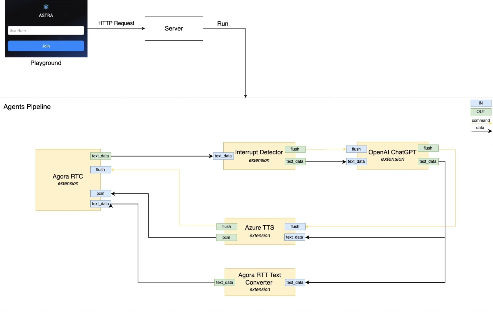

<div align="center">

[](https://twitter.com/intent/follow?screen_name=AstraFramework)
[](https://github.com/rte-design/astra.ai/discussions/)
[](https://github.com/rte-design/astra.ai/graphs/commit-activity)
[](https://github.com/rte-design/ASTRA.ai/issues)
[](https://github.com/rte-design/ASTRA.ai/pulls)
[](https://github.com/rte-design/ASTRA.ai/blob/main/LICENSE)

[](https://discord.gg/VnPftUzAMJ)

[](https://GitHub.com/rte-design/astra.ai/watchers/?WT.mc_id=academic-105485-koreyst)
[](https://GitHub.com/rte-design/astra.ai/network/?WT.mc_id=academic-105485-koreyst)
[](https://GitHub.com/rte-design/astra.ai/stargazers/?WT.mc_id=academic-105485-koreyst)

<a href="./README.md"></a>
<a href="./docs/readmes/README-CN.md"></a>

[Lightning Fast](./docs/astra-architecture.md)
<span>&nbsp;&nbsp;•&nbsp;&nbsp;</span>
[Multimodal Interactive](./docs/astra-architecture.md#astra-extension)
<span>&nbsp;&nbsp;•&nbsp;&nbsp;</span>
[Highly Customizable](./docs/astra-architecture.md#-astra-extension-store)

</div>

<br>
<h2>Voice agent: Astra</h2>

[Voice agent: Astra](https://theastra.ai)

We showcase an impressive voice agent called Astra, powered by TEN, demonstrating its ability to create intuitive and seamless conversational interactions.

[](https://theastra.ai)

<br>
<h2>How to build voice agent locally</h2>


#### Prerequisites

- Agora App ID and App Certificate([read here on how](https://docs.agora.io/en/video-calling/get-started/manage-agora-account?platform=web))
- Azure's [speech-to-text](https://azure.microsoft.com/en-us/products/ai-services/speech-to-text) and [text-to-speech](https://azure.microsoft.com/en-us/products/ai-services/text-to-speech) API keys
- [OpenAI](https://openai.com/index/openai-api/) API key
- [Docker](https://www.docker.com/) / [Docker Compose](https://docs.docker.com/compose/)
- [Node.js(LTS) v18](https://nodejs.org/en)

#### Docker setting on apple silicon
You will need to uncheck "Use Rosetta for x86_64/amd64 emulation on apple silicon" option for Docker if you are on Apple Silicon, otherwise the server is not gonna work.

<div align="center">


</div>


#### 1. Prepare config files

```bash
# Create property.json from the example
cp ./agents/property.json.example ./agents/property.json

# Create .env from the example
cp ./.env.example ./.env
```

#### 2. Setup API keys & Environment varialbes in .env file
```
...
# Agora App ID and Agora App Certificate
# required: this variable must be set
AGORA_APP_ID=
AGORA_APP_CERTIFICATE=
...
# Extension: agora_rtc
# Azure STT key and region
AZURE_STT_KEY=
AZURE_STT_REGION=

# Extension: azure_tts
# Azure TTS key and region
AZURE_TTS_KEY=
AZURE_TTS_REGION=
...
# Extension: openai_chatgpt
# OpenAI API key
OPENAI_API_KEY=
```

#### 3. Create agent in Docker container

```bash
# Execute docker compose up to start the services
# This should start an playground running on port 3000, graph designer running on port 30001 and agent development container
docker compose up -d

# Enter container
docker exec -it astra_agents_dev bash

# Create agent
make build
```

#### 4. Start server

```bash
# Run server on port 8080
make run-server

# Run graph designer server on port 49483
make run-gd-server
```

#### 5. Verify your customized voice agent 🎉

Open `localhost:3000` in your browser, you should be seeing a voice agent just like the Astra, yet with your own customizations.
Open `localhost:3001` in your browser, you can orchestrate property.json through the Graph Designer.

<br>
<h2>Voice agent architecture </h2>

To explore further, the voice agent is an excellent starting point. It incorporates various extensions, some of which are interchangeable. Feel free to select the ones that best suit your needs and maximize its capabilities.


| Extension          | Feature        | Description                                                                                                                                                                                                          |
| ------------------ | -------------- | -------------------------------------------------------------------------------------------------------------------------------------------------------------------------------------------------------------------- |
| openai_chatgpt     | LLM            | [ GPT-4o ](https://platform.openai.com/docs/models/gpt-4o), [ GPT-4 Turbo ](https://platform.openai.com/docs/models/gpt-4-turbo-and-gpt-4), [ GPT-3.5 Turbo ](https://platform.openai.com/docs/models/gpt-3-5-turbo) |
| elevenlabs_tts     | Text-to-speech | [ElevanLabs text to speech](https://elevenlabs.io/) converts text to audio                                                                                                                                           |
| azure_tts          | Text-to-speech | [Azure text to speech](https://azure.microsoft.com/en-us/products/ai-services/text-to-speech) converts text to audio                                                                                                 |
| azure_stt          | Speech-to-text | [Azure speech to text](https://azure.microsoft.com/en-us/products/ai-services/speech-to-text) converts audio to text                                                                                                 |
| chat_transcriber   | Transcriber    | A utility ext to forward chat logs into channel                                                                                                                                                                      |
| agora_rtc          | Transporter    | A low latency transporter powered by agora_rtc                                                                                                                                                                       |
| interrupt_detector | Interrupter    | A utility ext to help interrupt agent                                                                                                                                                                                |

<h3>Voice Agent Diagram</h3>



<br>
<h2>TEN Service</h2>
<h3>Discover More</h3>

Now that you’ve created your first AI agent, the creativity doesn’t stop here. To develop more amazing agents, you’ll need an advanced understanding of how the TEN works under the hood. Please refer to the [ TEN service documentation ](./docs/astra-architecture.md).

<br>
<h2>Stay Tuned</h2>

Before we dive further, be sure to star our repository and get instant notifications for all new releases!


<br>
<h2>Join Community</h2>

- [Discord](https://discord.gg/VnPftUzAMJ): Ideal for sharing your applications and engaging with the community.
- [Github Discussion](https://github.com/rte-design/astra.ai/discussions): Perfect for providing feedback and asking questions.
- [GitHub Issues](https://github.com/rte-design/astra.ai/issues): Best for reporting bugs and proposing new features. Refer to our [contribution guidelines](./docs/code-of-conduct/contributing.md) for more details.
- [X (formerly Twitter)](https://twitter.com/intent/follow?screen_name=AstraFramework): Great for sharing your agents and interacting with the community.

 <br>
 <h2>Code Contributors</h2>

[](https://github.com/rte-design/astra.ai/graphs/contributors)

<br>
<h2>Contribution Guidelines</h2>

Contributions are welcome! Please read the [contribution guidelines](CONTRIBUTING.md) first.

<br>
<h2>License</h2>

This project is licensed under the Apache 2.0 License - see the [LICENSE](LICENSE) file for details.