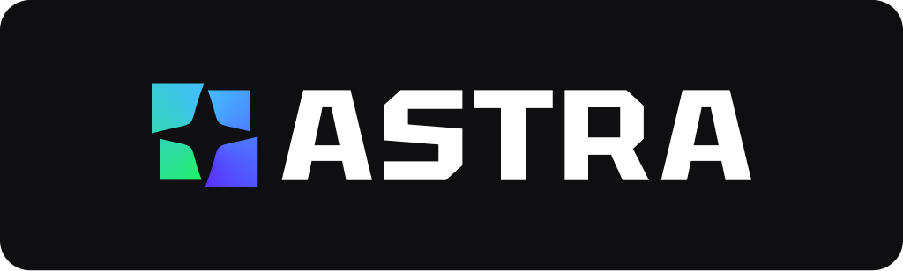

<div align="center">
 
</div>

<br>

<div align="center">

<a href="https://discord.gg/p85NR8UD" target="_blank"></a>
<a href="" target="_blank">
</a>
<a href="" target="_blank">
</a>
<a href="" target="_blank">
</a>

</div>

<p align="center">
<a href="./README.md"></a>
<a href="./README-CN.md"></a>
</p>

<div align="center">
        <a href="" target="">
        <span>Real-time Multi-model Interactions</span>
        </a>
        <span>&nbsp;&nbsp;•&nbsp;&nbsp;</span>
        <a href="" target="">
        <span>Low Latency</span>
        </a>
        <span>&nbsp;&nbsp;•&nbsp;&nbsp;</span>
        <a href="" target="">
        <span>Supporting Multiple languages</span>
        </a>
</div>

<br >

ASTRA is an open-source platform designed for developing applications utilizing large language models. It merges the ideas of Backend-as-a-Service and LLM operations, allowing developers to swiftly create production-ready generative AI applications. Additionally, it empowers non-technical users to engage in defining and managing data operations for AI applications.

With ASTRA, you can easily create real-time, multi-modal AI applications with low latency, even without any coding knowledge. 🎉

<br>

## Voice Agent

ASTRA is a versatile platform that can be used to build a wide range of applications. Here, we present a fantastic example of [an intuitive Voice Agent ](https://astra-agents.agora.io/) built on ASTRA.

<div align="center">

</div>

As you can see, the real-time multimodal interactions, low latency, and responsive feedback all showcase the power of ASTRA.

### Run Voice Agent Locally

Of course, you are more than welcome to run our voice agent locally. We have a Docker image ready for you to build and run the agent on both macOS and Windows.

#### Mac with Apple Silicon

> [!NOTE]
> You will need to uncheck "Use Rosetta for x86_64/amd64 emulation on apple silicon" option for Docker if you are on Apple Silicon.
>
> 

To start, make sure you have:

- Agora App ID and App Certificate([Read here on how](https://docs.agora.io/en/video-calling/get-started/manage-agora-account?platform=web))
- Azure's [speech-to-text](https://azure.microsoft.com/en-us/products/ai-services/speech-to-text) and [text-to-speech](https://azure.microsoft.com/en-us/products/ai-services/text-to-speech) API keys
- [OpenAI](https://openai.com/index/openai-api/) API key
- [Docker](https://www.docker.com/)

```bash
# run the pre-built agent image
docker run --restart=always -itd -p 8080:8080 \
        -v /tmp:/tmp \
        -e AGORA_APP_ID=<your_agora_appid> \
        -e AGORA_APP_CERTIFICATE=<your_agora_app_certificate> \
        -e AZURE_STT_KEY=<your_azure_stt_key> \
        -e AZURE_STT_REGION=<your_azure_stt_region> \
        -e OPENAI_API_KEY=<your_openai_api_key> \
        -e AZURE_TTS_KEY=<your_azure_tts_key> \
        -e AZURE_TTS_REGION=<your_azure_tts_region> \
        --name astra_agents_server \
        agoraio/astra_agents_server:0.1.2
```

This should start an agent server running on port 8080.

### Use the playground to connect to your agent

You can use the playground project to test with the server you just started.

The Playground project is built on NextJS 14, hence it needs Node 18+.

```bash
# set up an .env file
cp ./playground/.env.example ./playground/.env
cd playground

# install npm dependencies & start
npm i && npm run dev
```

🎉 Congratulations! You now have our ASTRA powered voice agent running locally.

</br>

# Agent Customization

Our voice agent is a great place for you to start with, it uses following Extensions:

- _agora_rtc_ / [Agora](https://docs.agora.io/en) for RTC transport + VAD + Azure speech-to-text (STT)
- _azure_tts_ / [Azure](https://azure.microsoft.com/en-us/products/ai-services/text-to-speech) for text-to-speech (TTS)
- _openai_chatgpt_ / [OpenAI](https://openai.com/index/openai-api/) for LLM
- _chat_transcriber_ / A utility ext to forward chat logs into channel
- _interrupt_detector_ / A utility ext to help interrupt agent

<div align="center">

<image alt="Astra.ai" width="800px" src="./images/image-2.png">

</div>

### Customize your own agent

You might want to add more flavors to make the agent better suited to your needs. To achieve this, you need to change the source code of extensions and build the agent yourselves.

You need to prepare the proper `manifest.json` file first.

```bash
# rename manifest example
cp ./agents/manifest.json.example ./agents/manifest.json

# pull the docker image with dev tools and mount your current folder as workspace
docker run -itd -v $(pwd):/app -w /app -p 8080:8080 --name astra_agents_dev agoraio/astra_agents_build:0.1.0

# enter docker image
docker exec -it astra_agents_dev bash

# build agent
make build
```

This code generates an agent executable. To customize your prompts and OpenAI parameters, modify the source code in agents/addon/extension/openai_chatgpt/openai_chatgpt.go.

Once you have made the necessary changes, you can use the following commands to start a server. You can then test it out using the Astra voice agent playground as we did in previous steps.

```bash

export AGORA_APP_ID=<your_agora_appid>
export AGORA_APP_CERTIFICATE=<your_agora_app_certificate>
export AZURE_STT_KEY=<your_azure_stt_key>
export AZURE_STT_REGION=<your_azure_stt_region>
export OPENAI_API_KEY=<your_openai_api_key>
export AZURE_TTS_KEY=<your_azure_tts_key>
export AZURE_TTS_REGION=<your_azure_tts_region>

# agent is ready to start on port 8080

make run-server
```

🎉 Congratulations! You have created your first personalized voice agent.

<br />

# Astra Service

Now let's discuss what's under the hood. The Astra Service is composed of various Astra extensions, developed in different programming languages. These extensions are interconnected using Graph, which describes their relationships and illustrates the flow of data. Furthermore, sharing and downloading extensions are simplified through the Astra Extension Store and the Astra Package Manager.

<div align="center">

<image alt="Astra.ai" width="800px" src="./images/image.png">

</div>

### Astra Extensions

An extension is the fundamental unit of composition within the Astra framework. Developers can create extensions in various programming languages and combine them to build diverse scenarios and applications. Astra emphasizes cross-language collaboration, allowing extensions written in different languages to work together seamlessly within the same application or service.

For example, if an application requires real-time communication (RTC) features and advanced AI capabilities, a developer might choose to write RTC-related extensions in C++ for its performance advantages in processing audio and video data. Meanwhile, they could develop AI extensions in Python to leverage its extensive libraries and frameworks for data analysis and machine learning tasks.

#### Supported Languages

As of June 2024, we support extensions written in the following languages:

- C++
- Golang
- Python (planned for July)

### Graph

A Graph in Astra describes the data flow between extensions, orchestrating their interactions. For example, the text output from a speech-to-text (STT) extension might be directed to a large language model (LLM) extension. Essentially, a Graph defines which extensions are involved and the direction of data flow between them. Developers can customize this flow, directing outputs from one extension, such as an STT, into another, like an LLM.

In Astra, there are four main types of data flow between extensions:

- Command
- Data
- Image frame
- PCM frame

By specifying the direction of these data types in the Graph, developers can enable mutual invocation and unidirectional data flow between plugins. This is especially useful for PCM and image data types, simplifying audio and video processing.

### Astra Agent App

An Astra Agent App is a runnable server-side application that combines multiple Extensions following Graph rules to accomplish more sophisticated operations.

### Astra Extension Store

The Astra Store is a centralized platform where developers can share their extensions and access those created by others.

### Astra Package Manager

The Astra Package Manager simplifies the process of uploading, sharing, downloading, and installing Astra extensions. Extensions can specify dependencies on other extensions and the environment, and the Astra Package Manager automatically manages these dependencies, making the installation and release of extensions extremely convenient and intuitive.

</br>

## Contributing

Contributions are welcome! Please read the [contribution guidelines](CONTRIBUTING.md) first.

</br>

## License

This project is licensed under the Apache 2.0 License - see the [LICENSE](LICENSE) file for details.
